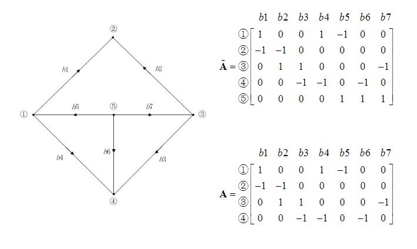

# 第二章 关联矩阵和网路方程

## 0 本章的核心问题
- 关联矩阵 
  （拓扑约束，反映各元件的连接方式）

- 一般支路
   （元件约束，主要是元件的伏安特性）
  
 ## 1 关联矩阵
- 节点-支路关联矩阵 `A`
- 基本回路-支路关联矩阵 `Bf`
- 基本割集-支路关联矩阵 `Qf`
  
### 1.1 “有向回路”
对于一个电路而言，电流的方向是任意取定的；在电路图中，所取定的电流的方向就是该条支路的方向。

### 1.2 节点-支路关联矩阵 `A`阵

#### 1.2.1 特点
- 行 对应 （除参考节点以外的）节点
- 列 对应  “有向”回路
- 元素`a`只有 `0` `1` `-1` 三种取值
- 若节点（含参考节点）共`m+1`个、支路共`n`个，则`A`阵是`m`行`n`列的

#### 1.2.2 如何生成`A`阵

对于某节点i而言，若有支路与之相连，
- 支路流入节点，`a`值取-1
- 支路流出节点，`a`值取1
- 若某条支路与该节点i无上述关系，`a`值取0。

为了生成`A`阵，只需：
- 遍历节点和支路
- 判断节点与支路是否直接连接
- 支路注入还是流出节点

#### 1.2.3 举例

支路的方向如图给定所示，以节点1为例
- 支路`b1`流出节点，故`a = 1`
- 支路`b5`流入节点，故`a = -1`
- 支路`b4`流入节点，故`a = 1`
- 其余支路与节点1不直接相连，故`a = 0`

> 图中，$\widetilde{A}$ 矩阵称为节点-支路关联矩阵的**增广矩阵**
